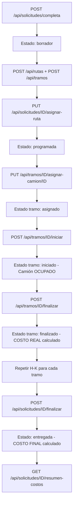

# 📚 GUÍA COMPLETA DE ENDPOINTS - SISTEMA DE TRANSPORTE

## 📋 Índice de Microservicios

1. [ms-Tarifas (Puerto 8092)](#ms-tarifas-puerto-8092)
2. [ms-Transporte (Puerto 8085)](#ms-transporte-puerto-8085)
3. [ms-Rutas (Puerto 8091)](#ms-rutas-puerto-8091)
4. [ms-Solicitudes (Puerto 8090)](#ms-solicitudes-puerto-8090)

## 🔗 Swagger UI de cada Microservicio

- **ms-Tarifas:** http://localhost:8092/swagger-ui.html
- **ms-Transporte:** http://localhost:8085/swagger-ui.html
- **ms-Rutas:** http://localhost:8091/swagger-ui.html
- **ms-Solicitudes:** http://localhost:8090/swagger-ui.html

---

## 🏷️ ms-Tarifas (Puerto 8092)

**Base URL:** `http://localhost:8092`
**Swagger:** http://localhost:8092/swagger-ui.html

### **Tarifas - CRUD Completo**

#### 1. Obtener todas las tarifas
```http
GET /api/tarifas
```
**Respuesta:**
```json
[
  {
    "id": 1,
    "tipo": "COSTO_KM_BASE",
    "descripcion": "Costo base por kilómetro",
    "valor": 5.00,
    "unidad": "km",
    "activo": true,
    "fechaActualizacion": "2025-01-12T10:00:00"
  }
]
```

#### 2. Obtener solo tarifas activas
```http
GET /api/tarifas/activas
```

#### 3. Obtener tarifa por ID
```http
GET /api/tarifas/{id}
```
**Ejemplo:**
```http
GET /api/tarifas/1
```

#### 4. Obtener tarifa por tipo ⭐ **IMPORTANTE para cálculos**
```http
GET /api/tarifas/tipo/{tipo}
```
**Ejemplos:**
```http
GET /api/tarifas/tipo/COSTO_KM_BASE
GET /api/tarifas/tipo/COMBUSTIBLE
GET /api/tarifas/tipo/ESTADIA_DEPOSITO
GET /api/tarifas/tipo/CARGO_GESTION_TRAMO
```

#### 5. Crear nueva tarifa
```http
POST /api/tarifas
Content-Type: application/json

{
  "tipo": "NUEVA_TARIFA",
  "descripcion": "Descripción de la tarifa",
  "valor": 100.00,
  "unidad": "unidad",
  "activo": true
}
```

#### 6. Actualizar tarifa
```http
PUT /api/tarifas/{id}
Content-Type: application/json

{
  "descripcion": "Nueva descripción",
  "valor": 150.00,
  "unidad": "km",
  "activo": true
}
```

#### 7. Eliminar (desactivar) tarifa
```http
DELETE /api/tarifas/{id}
```

#### 8. Inicializar tarifas por defecto
```http
POST /api/tarifas/inicializar
```
**Crea 4 tarifas:**
- COSTO_KM_BASE: $5.00/km
- COMBUSTIBLE: $1.50/litro
- ESTADIA_DEPOSITO: $50.00/día
- CARGO_GESTION_TRAMO: $100.00/tramo ⭐ NUEVO

#### 9. Calcular costo de transporte (estimado)
```http
POST /api/tarifas/calcular-costo
Content-Type: application/json

{
  "distanciaKm": 150.0,
  "volumenM3": 20.0,
  "pesoKg": 5000.0,
  "diasEstadia": 2,
  "consumoCombustibleLitrosPorKm": 0.35
}
```
**Respuesta:**
```json
{
  "distanciaKm": 150.0,
  "costoKilometraje": 750.00,
  "costoCombustible": 78.75,
  "costoEstadia": 100.00,
  "costoTotal": 928.75
}
```

#### 10. Health check
```http
GET /api/tarifas/health
```

---

## 🚛 ms-Transporte (Puerto 8085)

**Base URL:** `http://localhost:8085`
**Swagger:** http://localhost:8085/swagger-ui.html

### **Camiones**

#### 1. Obtener todos los camiones
```http
GET /api/camiones
```
**Respuesta:**
```json
[
  {
    "idCamion": 1,
    "patente": "ABC123",
    "telefono": "1234567890",
    "capacidadPeso": 5000.0,
    "capacidadVolumen": 30.0,
    "disponibilidad": true,
    "costoBaseKm": 7.50,
    "consumoCombustibleKm": 0.35,
    "transportista": {
      "idTransportista": 1,
      "nombre": "Juan",
      "apellido": "Perez"
    }
  }
]
```

#### 2. Obtener camión por ID
```http
GET /api/camiones/{id}
```

#### 3. Crear camión
```http
POST /api/camiones
Content-Type: application/json

{
  "patente": "XYZ789",
  "telefono": "1234567890",
  "capacidadPeso": 5000.0,
  "capacidadVolumen": 30.0,
  "disponibilidad": true,
  "costoBaseKm": 7.50,
  "consumoCombustibleKm": 0.35,
  "transportista": {
    "nombre": "Carlos",
    "apellido": "Rodriguez",
    "dni": "12345678",
    "telefono": "1122334455"
  }
}
```

#### 4. Actualizar camión
```http
PUT /api/camiones/{id}
Content-Type: application/json

{
  "patente": "XYZ789",
  "telefono": "0987654321",
  "capacidadPeso": 6000.0,
  "capacidadVolumen": 35.0,
  "disponibilidad": true,
  "costoBaseKm": 8.00,
  "consumoCombustibleKm": 0.40
}
```

#### 5. Eliminar camión
```http
DELETE /api/camiones/{id}
```

#### 6. ✨ Actualizar disponibilidad de camión **NUEVO**
```http
PATCH /api/camiones/{id}/disponibilidad?disponible=true
```
**Ejemplos:**
```http
PATCH /api/camiones/1/disponibilidad?disponible=false  # Marcar como ocupado
PATCH /api/camiones/1/disponibilidad?disponible=true   # Marcar como disponible
```
**Respuesta:**
```json
{
  "idCamion": 1,
  "patente": "ABC123",
  "disponibilidad": false
}
```

### **Transportistas**

#### 7. Obtener todos los transportistas
```http
GET /api/transportistas
```

#### 8. Obtener transportista por ID
```http
GET /api/transportistas/{id}
```

#### 9. Crear transportista
```http
POST /api/transportistas
Content-Type: application/json

{
  "nombre": "Pedro",
  "apellido": "Gomez",
  "dni": "87654321",
  "telefono": "1122334455"
}
```

#### 10. Actualizar transportista
```http
PUT /api/transportistas/{id}
Content-Type: application/json

{
  "nombre": "Pedro",
  "apellido": "Gomez",
  "dni": "87654321",
  "telefono": "9988776655"
}
```

#### 11. Eliminar transportista
```http
DELETE /api/transportistas/{id}
```

---

## 🛣️ ms-Rutas (Puerto 8091)

**Base URL:** `http://localhost:8091`
**Swagger:** http://localhost:8091/swagger-ui.html

### **Rutas**

#### 1. Obtener todas las rutas
```http
GET /api/rutas
```

#### 2. Obtener ruta por ID
```http
GET /api/rutas/{id}
```

#### 3. Crear ruta
```http
POST /api/rutas
Content-Type: application/json

{
  "cantidadTramos": 2,
  "cantidadDepositos": 1,
  "distanciaTotal": 300.0,
  "tiempoEstimadoMin": 360.0,
  "costoTotal": 2000.0
}
```

#### 4. Eliminar ruta
```http
DELETE /api/rutas/{id}
```

#### 5. Obtener resumen de ruta
```http
GET /api/rutas/{id}/resumen
```
**Respuesta:**
```json
{
  "idRuta": 1,
  "cantidadTramos": 2,
  "cantidadDepositos": 1,
  "costoAproximado": 1800.00
}
```

#### 6. Obtener rutas tentativas
```http
GET /api/rutas/tentativas
```

#### 7. Obtener ruta tentativa por ID
```http
GET /api/rutas/{id}/tentativa
```

#### 8. ✨ Obtener tramos de una ruta **NUEVO**
```http
GET /api/rutas/{idRuta}/tramos
```
**Respuesta:**
```json
[
  {
    "idTramo": 1,
    "distanciaKm": 150.0,
    "costoAproximado": 900.00,
    "costoReal": 1403.75,
    "fechaHoraInicio": "2025-01-10T08:00:00",
    "fechaHoraFin": "2025-01-12T14:00:00",
    "idCamion": 1,
    "estado": {
      "nombre": "finalizado"
    }
  }
]
```

### **Tramos**

#### 9. Obtener todos los tramos
```http
GET /api/tramos
```

#### 10. Obtener tramo por ID
```http
GET /api/tramos/{id}
```

#### 11. Crear tramo
```http
POST /api/tramos
Content-Type: application/json

{
  "latitudOrigen": -34.6037,
  "longitudOrigen": -58.3816,
  "latitudDestino": -34.7037,
  "longitudDestino": -58.4816,
  "distanciaKm": 150.0,
  "costoAproximado": 900.00,
  "ruta": {
    "idRuta": 1
  },
  "depositoDestino": {
    "idDeposito": 1
  }
}
```

#### 12. Eliminar tramo
```http
DELETE /api/tramos/{id}
```

#### 13. Asignar camión a tramo
```http
PUT /api/tramos/{idTramo}/asignar-camion/{idCamion}
```
**Ejemplo:**
```http
PUT /api/tramos/1/asignar-camion/1
```

#### 14. ✨ **INICIAR TRAMO** (Transportista) **NUEVO**
```http
POST /api/tramos/{id}/iniciar
Content-Type: application/json

{}
```
**O con fecha específica:**
```http
POST /api/tramos/{id}/iniciar
Content-Type: application/json

{
  "fechaHoraInicio": "2025-01-10T08:00:00",
  "observaciones": "Inicio del viaje"
}
```
**Respuesta:**
```json
{
  "success": true,
  "message": "Tramo iniciado exitosamente",
  "tramo": {
    "idTramo": 1,
    "fechaHoraInicio": "2025-01-10T08:00:00",
    "idCamion": 1
  },
  "fechaHoraInicio": "2025-01-10T08:00:00",
  "estado": "iniciado"
}
```
**Roles requeridos:** `TRANSPORTISTA` o `ADMIN`

**Lo que hace:**
- ✅ Registra `fechaHoraInicio`
- ✅ Cambia estado del tramo a "iniciado"
- ✅ **Marca el camión como NO disponible** 🔴

#### 15. ✨ **FINALIZAR TRAMO** (Transportista) **NUEVO**
```http
POST /api/tramos/{id}/finalizar
Content-Type: application/json

{}
```
**O con fecha específica:**
```http
POST /api/tramos/{id}/finalizar
Content-Type: application/json

{
  "fechaHoraFin": "2025-01-12T14:00:00",
  "observaciones": "Llegada al destino"
}
```
**Respuesta:**
```json
{
  "success": true,
  "message": "Tramo finalizado exitosamente",
  "tramo": {
    "idTramo": 1,
    "fechaHoraInicio": "2025-01-10T08:00:00",
    "fechaHoraFin": "2025-01-12T14:00:00",
    "costoReal": 1403.75,
    "distanciaKm": 150.0
  },
  "fechaHoraInicio": "2025-01-10T08:00:00",
  "fechaHoraFin": "2025-01-12T14:00:00",
  "costoReal": 1403.75,
  "estado": "finalizado"
}
```
**Roles requeridos:** `TRANSPORTISTA` o `ADMIN`

**Lo que hace:**
- ✅ Registra `fechaHoraFin`
- ✅ **CALCULA EL COSTO REAL** 💰
  - Kilometraje del camión
  - Combustible del camión
  - Estadía en depósito (si aplica)
  - Cargo de gestión
- ✅ Cambia estado del tramo a "finalizado"
- ✅ **Libera el camión** (disponible = true) ✅

#### 16. ✨ **VER DETALLE DEL COSTO REAL** **NUEVO**
```http
GET /api/tramos/{id}/costo-real
```
**Respuesta:**
```json
{
  "idTramo": 1,
  "distanciaKm": 150.00,
  "costoBaseKmCamion": 7.50,
  "costoKilometraje": 1125.00,
  "consumoCombustibleKm": 0.35,
  "precioCombustible": 1.50,
  "costoCombustible": 78.75,
  "diasEstadia": 2,
  "costoEstadiaDiario": 50.00,
  "costoEstadia": 100.00,
  "cargoGestion": 100.00,
  "costoTotal": 1403.75,
  "detalleCalculo": "Kilometraje: $7.50/km × 150.00 km = $1125.00 | Combustible: 0.35 L/km × 150.00 km × $1.50/L = $78.75 | Estadía en Depósito Central: 2 días × $50.00/día = $100.00 | Gestión: $100.00"
}
```

**Desglose del cálculo:**
```
Costo Kilometraje  = costoBaseKm × distancia
                   = $7.50/km × 150 km = $1,125.00

Costo Combustible  = consumoKm × distancia × precio
                   = 0.35 L/km × 150 km × $1.50/L = $78.75

Costo Estadía      = días × tarifa diaria
                   = 2 días × $50/día = $100.00

Cargo Gestión      = valor fijo = $100.00

TOTAL              = $1,403.75
```

### **Depósitos**

#### 17. Obtener todos los depósitos
```http
GET /api/depositos
```

#### 18. Obtener depósito por ID
```http
GET /api/depositos/{id}
```

#### 19. Crear depósito
```http
POST /api/depositos
Content-Type: application/json

{
  "nombre": "Depósito Central",
  "direccion": "Av. Principal 123",
  "latitud": -34.6037,
  "longitud": -58.3816,
  "costoEstadiaDiario": 50.00
}
```

#### 20. Actualizar depósito
```http
PUT /api/depositos/{id}
Content-Type: application/json

{
  "nombre": "Depósito Central",
  "direccion": "Av. Principal 456",
  "latitud": -34.6037,
  "longitud": -58.3816,
  "costoEstadiaDiario": 60.00
}
```

#### 21. Eliminar depósito
```http
DELETE /api/depositos/{id}
```

### **Ciudades**

#### 22. Obtener todas las ciudades
```http
GET /api/ciudades
```

#### 23. Obtener ciudad por ID
```http
GET /api/ciudades/{id}
```

#### 24. Crear ciudad
```http
POST /api/ciudades
Content-Type: application/json

{
  "nombre": "Buenos Aires",
  "provincia": "Buenos Aires",
  "latitud": -34.6037,
  "longitud": -58.3816
}
```

### **Estados de Tramo**

#### 25. Obtener todos los estados de tramo
```http
GET /api/estados-tramo
```

### **Tipos de Tramo**

#### 26. Obtener todos los tipos de tramo
```http
GET /api/tipos-tramo
```

### **Google Maps**

#### 27. Calcular distancia entre dos puntos
```http
GET /api/google-maps/distancia?latOrigen={lat1}&lonOrigen={lon1}&latDestino={lat2}&lonDestino={lon2}
```

---

## 📋 ms-Solicitudes (Puerto 8090)

**Base URL:** `http://localhost:8090`
**Swagger:** http://localhost:8090/swagger-ui.html

### **Solicitudes**

#### 1. Obtener todas las solicitudes
```http
GET /api/solicitudes
```

#### 2. Obtener solicitud por ID
```http
GET /api/solicitudes/{id}
```

#### 3. Crear solicitud simple
```http
POST /api/solicitudes
Content-Type: application/json

{
  "contenedor": {
    "peso": 1000,
    "volumen": 10
  },
  "cliente": {
    "idCliente": 1
  },
  "estadoSolicitud": {
    "idEstado": 1
  }
}
```

#### 4. Eliminar solicitud
```http
DELETE /api/solicitudes/{id}
```

#### 5. Crear solicitud completa
```http
POST /api/solicitudes/completa
Content-Type: application/json

{
  "pesoContenedor": 1000,
  "volumenContenedor": 10,
  "nombreCliente": "María",
  "apellidoCliente": "García",
  "dniCliente": "87654321",
  "telefonoCliente": "0987654321",
  "mailCliente": "maria@email.com",
  "direccionCliente": "Calle Falsa 123",
  "estadoInicial": "borrador"
}
```
**Respuesta:**
```json
{
  "numeroSolicitud": 1,
  "contenedor": {
    "idContenedor": 1,
    "peso": 1000,
    "volumen": 10
  },
  "cliente": {
    "idCliente": 1,
    "nombre": "María",
    "apellido": "García",
    "dni": "87654321"
  },
  "estadoSolicitud": {
    "idEstado": 1,
    "nombre": "borrador"
  }
}
```

#### 6. Obtener solicitud con su ruta completa
```http
GET /api/solicitudes/{idSolicitud}/rutas
```

#### 7. Consultar estado de un contenedor
```http
GET /api/solicitudes/contenedor/{idContenedor}/estado
```
**Respuesta:**
```json
{
  "idContenedor": 1,
  "estadoActual": "en tránsito",
  "numeroSolicitud": 1
}
```

#### 8. Asignar ruta a solicitud
```http
PUT /api/solicitudes/{idSolicitud}/asignar-ruta
Content-Type: application/json

{
  "idRuta": 1,
  "costoEstimado": 1800.00,
  "tiempoEstimado": 360
}
```
**Respuesta:**
```json
{
  "numeroSolicitud": 1,
  "idRuta": 1,
  "costoEstimado": 1800.00,
  "tiempoEstimado": 360,
  "estadoSolicitud": {
    "nombre": "programada"
  }
}
```

#### 9. Desasignar ruta de solicitud
```http
DELETE /api/solicitudes/{idSolicitud}/desasignar-ruta
```

#### 10. Consultar contenedores pendientes de entrega
```http
GET /api/solicitudes/contenedores-pendientes
```

#### 11. ✨ **FINALIZAR SOLICITUD CON COSTO FINAL** **NUEVO**
```http
POST /api/solicitudes/{id}/finalizar
```
**Respuesta:**
```json
{
  "numeroSolicitud": 1,
  "costoEstimado": 1800.00,
  "costoFinal": 2607.50,
  "tiempoEstimado": 360,
  "tiempoReal": 130,
  "estadoSolicitud": {
    "nombre": "entregada"
  }
}
```

**Lo que hace:**
- ✅ Obtiene todos los tramos de la ruta
- ✅ Valida que TODOS estén finalizados
- ✅ **Suma los costos reales de todos los tramos** → `costoFinal`
- ✅ Calcula tiempo real en horas
- ✅ Cambia estado a "entregada"

**Validación:** Si algún tramo NO está finalizado, devuelve error:
```json
{
  "error": "No todos los tramos de la ruta están finalizados. Finalice todos los tramos antes de finalizar la solicitud."
}
```

#### 12. ✨ **VER RESUMEN COMPARATIVO** (Estimado vs Real) **NUEVO**
```http
GET /api/solicitudes/{id}/resumen-costos
```
**Respuesta:**
```json
{
  "idSolicitud": 1,
  "costoEstimado": 1800.00,
  "costoFinal": 2607.50,
  "tiempoEstimado": 360,
  "tiempoReal": 130,
  "estado": "entregada",
  "diferenciaCosto": 807.50,
  "porcentajeDiferencia": 44.86,
  "diferenciaTiempo": -230
}
```

**Interpretación:**
- `diferenciaCosto`: $807.50 más de lo estimado
- `porcentajeDiferencia`: 44.86% más caro
- `diferenciaTiempo`: -230 horas (más rápido que lo estimado)

### **Clientes**

#### 13. Obtener todos los clientes
```http
GET /api/clientes
```

#### 14. Obtener cliente por ID
```http
GET /api/clientes/{id}
```

#### 15. Crear cliente
```http
POST /api/clientes
Content-Type: application/json

{
  "nombre": "Pedro",
  "apellido": "Lopez",
  "dni": "11223344",
  "telefono": "1122334455",
  "mail": "pedro@email.com",
  "direccion": "Calle Nueva 789"
}
```

#### 16. Actualizar cliente
```http
PUT /api/clientes/{id}
Content-Type: application/json

{
  "nombre": "Pedro",
  "apellido": "Lopez",
  "dni": "11223344",
  "telefono": "9988776655",
  "mail": "pedro.nuevo@email.com",
  "direccion": "Calle Actualizada 123"
}
```

#### 17. Eliminar cliente
```http
DELETE /api/clientes/{id}
```

### **Contenedores**

#### 18. Obtener todos los contenedores
```http
GET /api/contenedores
```

#### 19. Obtener contenedor por ID
```http
GET /api/contenedores/{id}
```

### **Estados**

#### 20. Obtener todos los estados
```http
GET /api/estados
```

---

## 🔄 FLUJO COMPLETO DE ENDPOINTS

### **Escenario: Transporte completo desde creación hasta entrega**



### **Paso a paso con números:**

1. `POST /api/solicitudes/completa` → Crear solicitud
2. `POST /api/rutas` → Crear ruta
3. `POST /api/tramos` → Crear tramos (repetir por cada tramo)
4. `PUT /api/solicitudes/1/asignar-ruta` → Asignar ruta
5. `PUT /api/tramos/1/asignar-camion/1` → Asignar camiones
6. ✨ `POST /api/tramos/1/iniciar` → Iniciar tramo (camión ocupado)
7. ✨ `POST /api/tramos/1/finalizar` → Finalizar tramo (costo real)
8. Repetir 6-7 para cada tramo
9. ✨ `POST /api/solicitudes/1/finalizar` → Finalizar solicitud (costo final)
10. ✨ `GET /api/solicitudes/1/resumen-costos` → Ver comparativa

---

## 🎯 ENDPOINTS POR ROL

### **Cliente**
- `POST /api/solicitudes/completa` - Crear solicitud
- `GET /api/solicitudes/contenedor/{id}/estado` - Consultar estado
- `GET /api/solicitudes/{id}` - Ver solicitud

### **Transportista**
- ✨ `POST /api/tramos/{id}/iniciar` - Iniciar tramo
- ✨ `POST /api/tramos/{id}/finalizar` - Finalizar tramo
- `GET /api/tramos` - Ver tramos asignados

### **Operador/Administrador**
- `POST /api/tarifas/inicializar` - Inicializar tarifas
- `PUT /api/tarifas/{id}` - Modificar tarifas
- `POST /api/camiones` - Gestionar camiones
- `POST /api/depositos` - Gestionar depósitos
- `PUT /api/solicitudes/{id}/asignar-ruta` - Asignar rutas
- `PUT /api/tramos/{id}/asignar-camion/{id}` - Asignar camiones
- ✨ `POST /api/solicitudes/{id}/finalizar` - Finalizar solicitud
- `GET /api/solicitudes/contenedores-pendientes` - Ver pendientes

---

## 📊 RESUMEN DE ENDPOINTS NUEVOS

| Endpoint | Método | Microservicio | Funcionalidad |
|----------|--------|---------------|---------------|
| `/api/tramos/{id}/iniciar` | POST | ms-Rutas (8091) | Iniciar tramo y ocupar camión |
| `/api/tramos/{id}/finalizar` | POST | ms-Rutas (8091) | Finalizar y calcular costo real |
| `/api/tramos/{id}/costo-real` | GET | ms-Rutas (8091) | Ver desglose del costo |
| `/api/solicitudes/{id}/finalizar` | POST | ms-Solicitudes (8090) | Finalizar con costo final |
| `/api/solicitudes/{id}/resumen-costos` | GET | ms-Solicitudes (8090) | Comparativa estimado vs real |
| `/api/camiones/{id}/disponibilidad` | PATCH | ms-Transporte (8093) | Actualizar disponibilidad |
| `/api/rutas/{id}/tramos` | GET | ms-Rutas (8091) | Obtener tramos de ruta |
| `/api/tarifas/inicializar` | POST | ms-Tarifas (8092) | Crear tarifas por defecto |

---

## 🔐 SEGURIDAD (Keycloak)

Si Keycloak está activo, agregar header en todas las peticiones:

```http
Authorization: Bearer {TOKEN}
```

**Obtener token:**
```http
POST http://localhost:8080/realms/{realm}/protocol/openid-connect/token
Content-Type: application/x-www-form-urlencoded

grant_type=password
&client_id={client_id}
&username={username}
&password={password}
```

---

## 📝 NOTAS IMPORTANTES

1. **Puertos por defecto:**
   - ms-Tarifas: 8092
   - ms-Transporte: 8085
   - ms-Rutas: 8091
   - ms-Solicitudes: 8090

2. **Estados de Tramo:**
   - `estimado` → Tramo creado
   - `asignado` → Camión asignado
   - `iniciado` → Tramo en curso
   - `finalizado` → Tramo completado con costo real

3. **Estados de Solicitud:**
   - `borrador` → Recién creada
   - `programada` → Ruta asignada
   - `en tránsito` → En proceso
   - `entregada` → Finalizada

4. **Costos:**
   - `costoAproximado/costoEstimado` → Antes del transporte
   - `costoReal/costoFinal` → Después del transporte

---

**Fecha:** 2025-01-12
**Estado:** ✅ COMPLETO Y ACTUALIZADO
**Total de Endpoints Documentados:** 60+
**Endpoints Nuevos Implementados:** 8
